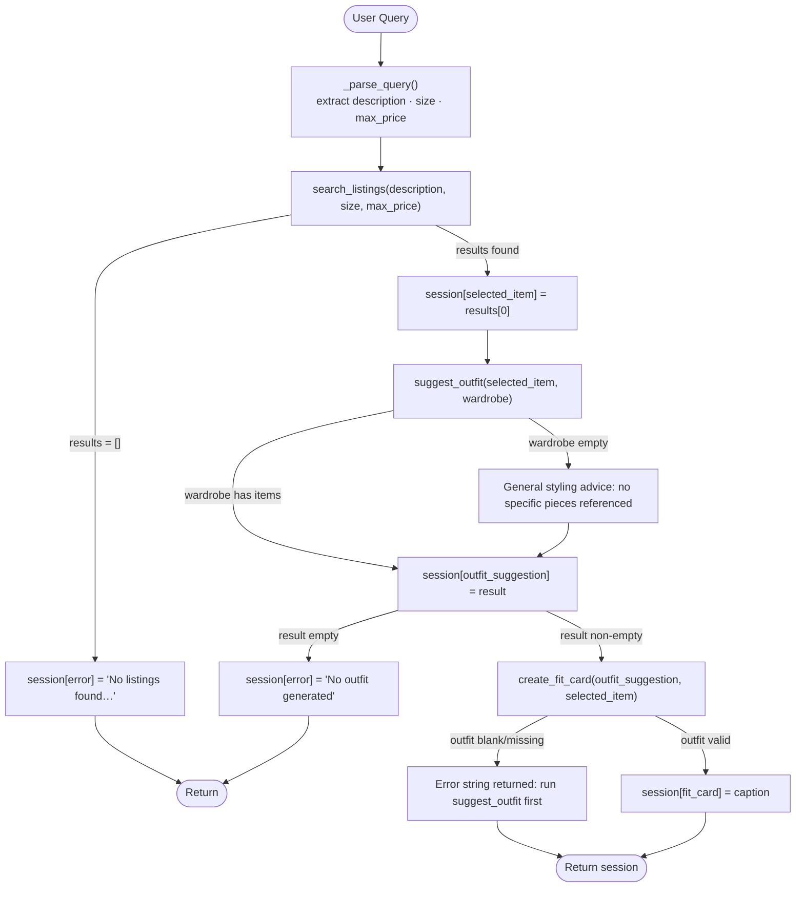
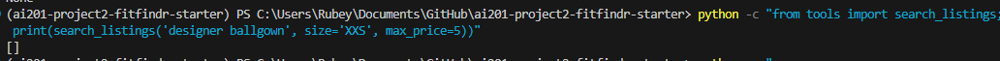
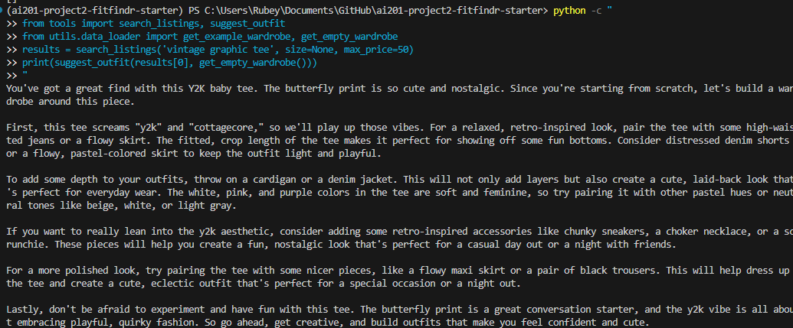
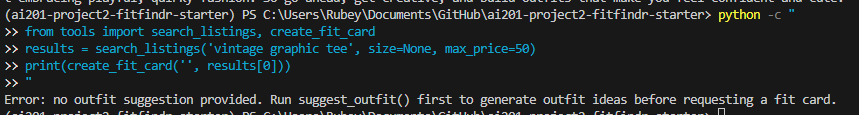

# FitFindr

An AI-powered secondhand styling agent. Describe what you're looking for, and FitFindr searches the listings, suggests outfits using your wardrobe, and generates a shareable fit card — all in one shot.

## Quick Start

```bash
pip install -r requirements.txt
```

Add your Groq API key to a `.env` file (free key at [console.groq.com](https://console.groq.com)):

```
GROQ_API_KEY=your_key_here
```

Run the app:

```bash
python app.py
```

Then open the localhost URL shown in your terminal (usually `http://localhost:7860`).

---

## Tool Inventory

### `search_listings`

**Purpose:** Keyword-scores every listing in `data/listings.json` and returns the best matches, optionally filtered by size and price ceiling. Pure Python — no LLM call.

**Signature:**
```python
search_listings(description: str, size: str | None = None, max_price: float | None = None) -> list[dict]
```

| Parameter | Type | Description |
|-----------|------|-------------|
| `description` | `str` | Natural language keywords (e.g. `"vintage graphic tee"`) |
| `size` | `str \| None` | Size to filter by; case-insensitive substring match (e.g. `"M"` matches `"S/M"`). `None` skips filtering. |
| `max_price` | `float \| None` | Inclusive price ceiling in USD. `None` skips filtering. |

**Returns:** `list[dict]` — listings sorted by relevance score (best match first). Each dict contains: `id`, `title`, `description`, `category`, `style_tags` (list), `size`, `condition`, `price` (float), `colors` (list), `brand`, `platform`. Returns `[]` when nothing matches — never raises.

---

### `suggest_outfit`

**Purpose:** Calls the Groq LLM to suggest 1–2 complete outfits pairing the thrifted item with pieces the user already owns. Falls back to general styling advice when the wardrobe is empty.

**Signature:**
```python
suggest_outfit(new_item: dict, wardrobe: dict) -> str
```

| Parameter | Type | Description |
|-----------|------|-------------|
| `new_item` | `dict` | A listing dict returned by `search_listings` |
| `wardrobe` | `dict` | User wardrobe with an `"items"` key (list of wardrobe item dicts). May be empty. |

**Returns:** `str` — non-empty outfit suggestion. If the wardrobe is empty, the string contains general styling advice (what types of pieces pair well, what aesthetic the item suits) instead of references to specific owned pieces.

**Model:** `llama-3.3-70b-versatile` via Groq, `temperature=1.0`

---

### `create_fit_card`

**Purpose:** Calls the Groq LLM to write a 2–4 sentence Instagram/TikTok OOTD caption that mentions the item name, price, and platform naturally. Higher temperature produces varied output for different inputs.

**Signature:**
```python
create_fit_card(outfit: str, new_item: dict) -> str
```

| Parameter | Type | Description |
|-----------|------|-------------|
| `outfit` | `str` | The outfit suggestion string returned by `suggest_outfit` |
| `new_item` | `dict` | The listing dict for the thrifted item (provides title, price, platform for the caption) |

**Returns:** `str` — a casual, authentic-sounding caption. If `outfit` is empty or whitespace-only, returns a descriptive error string (no exception raised).

**Model:** `llama-3.3-70b-versatile` via Groq, `temperature=1.2`

---

## Planning Loop

`run_agent(query, wardrobe)` in [agent.py](agent.py) runs the tools in a fixed four-step sequence. The loop decides what to do next by inspecting the previous step's output in the session dict — it never backtracks or re-runs a tool.



The loop knows it is done when either an error gate fires (early return with `session["error"]` set) or `create_fit_card` completes and `session["fit_card"]` is populated.

---

## State Management

All state lives in a single session dict initialized by `_new_session()` at the start of each `run_agent()` call. Each tool writes its output to a dedicated field; the next tool reads from that field. No state is passed as function arguments between steps — everything flows through the dict.

```python
session = {
    "query":             str,   # original user input
    "parsed":            dict,  # { description, size, max_price } from LLM parser
    "search_results":    list,  # all matching listing dicts
    "selected_item":     dict,  # top result; input to suggest_outfit
    "wardrobe":          dict,  # user's wardrobe; passed to suggest_outfit
    "outfit_suggestion": str,   # output of suggest_outfit; input to create_fit_card
    "fit_card":          str,   # final caption output
    "error":             str,   # set on early exit; None on success
}
```

If a step fails, `session["error"]` is set and `run_agent` returns immediately. All downstream fields remain `None`. The caller checks `session["error"]` first — `app.py` surfaces it in the listing panel and leaves the other two panels empty.

---

## Error Handling

### `search_listings` — no matching results

**Failure mode:** The keyword scorer produces a score of 0 for every listing, or all listings are filtered out by price/size constraints. The function returns `[]`.

**Agent response:** `run_agent` checks `if not session["search_results"]` and sets:
```
session["error"] = "No listings found for '...'. Try different keywords, a higher budget, or a different size."
```
The loop returns immediately. `outfit_suggestion` and `fit_card` stay `None`.

**Concrete example from testing:**
```python
results = search_listings("xyzzy nonsense garment", max_price=0.01)
assert results == []  # test_no_match_returns_empty_list — passes
```
Running `run_agent(query="designer ballgown size XXS under $5", wardrobe=...)` in the CLI test block exercises the same path end-to-end and prints `"Error message: No listings found for..."`.



---

### `suggest_outfit` — empty wardrobe

**Failure mode:** `wardrobe["items"]` is an empty list. Rather than crashing or returning an empty string, the function switches its LLM prompt to request general styling advice.

**Agent response:** The tool never errors out; it always returns a non-empty string. The agent then passes that general-advice string into `create_fit_card` normally. If the LLM somehow returns an empty string, the loop sets `session["error"]` and exits early.

**Concrete example from testing:**
```python
# test_empty_wardrobe_returns_general_styling_advice (mocked)
result = suggest_outfit(GRUNGE_ITEM, EMPTY_WARDROBE)
assert isinstance(result, str) and len(result) > 0
# mocked reply: "This graphic tee works great as a base layer — try pairing it with
# wide-leg trousers or baggy denim and chunky sneakers for a relaxed 90s vibe."
```



---

### `create_fit_card` — missing outfit input

**Failure mode:** `outfit` is an empty string or whitespace-only (which would happen if `suggest_outfit` somehow returned `""`).

**Agent response:** The function guards at the top and returns a descriptive error string without calling the LLM:
```python
if not outfit or not outfit.strip():
    return (
        "Error: no outfit suggestion provided. Run suggest_outfit() first "
        "to generate outfit ideas before requesting a fit card."
    )
```
The agent in `run_agent` detects the empty `suggest_outfit` result before calling `create_fit_card`, so in practice this guard is a second safety net.

**Concrete example from testing:**
```python
# test_empty_outfit_returns_error_string_not_exception
for bad_input in ("", "   \t\n  "):
    result = create_fit_card(bad_input, DENIM_ITEM)
    assert "error" in result.lower() or "suggest_outfit" in result.lower()
    # No exception raised — always returns a string
```



---

## Spec Reflection

### One way the spec helped

The spec allowed me to be more efficient with my AI usage. I only have to prompt the AI twice for each tool implementation: one to prompt the AI to create the tool, the second to write test cases to make sure what the AI output conform to the spec. The spec was also useful to review the code flow and make sure that it matches the architecture diagram.

### What changed during implementation

`_parse_query()` was not originally in the spec since I was mainly focusing on the tools. This was adden during the implementation of agent.py when I realized that I need to get the search_listing() parameters from the user's query.
I also had to update the prompt for create_fit_card() to force the caption to be less than 120 characters. Otherwise, the social media caption generated by the LLM would be way too long.

---

## AI Usage

<!-- Describe at least 2 specific instances where you used an AI tool during this project.
     For each: what did you give the AI as input, what did it produce, and what did you
     change, override, or direct differently?

     "I used Claude to help me code" is not sufficient.
     "I gave Claude my Chunking Strategy section from planning.md and asked it to implement
     chunk_text(). It returned a function using a fixed character split. I overrode the
     chunk size from 500 to 200 because my documents are short reviews, not long guides." -->

**Instance 1**

I gave Claude my Tool 1 spec, search_listing() and asked it to implement it using load listings() from data_loader.py. I reviewd the code and see how it score each item in the listing and verify the control flow. I also prompted Claude to write me three tests: one with a matching result, one to verify max price, and one with an empty result. I verify that the tests work and commited the change.

**Instance 2**

I gave Claude my Tool 3 spec and asked it to implement create_fit_card(). I also asked Claude to write three tests: one testing with a complete suggestion, one with an incomplete suggestion, and one with the input missing/empty. Claude gave me a pytest module that use MagicMock to mock the API calls. The mocked test works but I prompt Claude to write me a script that test the create_fit_card() function using actual Groq API call. That was when I found out the generated caption was way too long. So I added the intruction "Caption must be under 120 characters" to the create_fit_card() prompt.

---

## Project Structure

```
fitfindr/
├── data/
│   ├── listings.json          # 40 mock secondhand listings
│   └── wardrobe_schema.json   # Wardrobe format + example wardrobe
├── utils/
│   └── data_loader.py         # load_listings(), get_example_wardrobe(), get_empty_wardrobe()
├── tests/
│   ├── test_search_listings.py
│   ├── test_suggest_outfit.py
│   └── test_create_fit_card.py
├── tools.py                   # search_listings, suggest_outfit, create_fit_card
├── agent.py                   # run_agent() — planning loop + state management
├── app.py                     # Gradio UI — handle_query() wires agent to interface
├── planning.md                # Design spec filled out before implementation
└── requirements.txt
```

Run all tests:

```bash
pytest
```

---

## Video Demo

[Demo](https://youtu.be/kn3mqF8MnFc)
