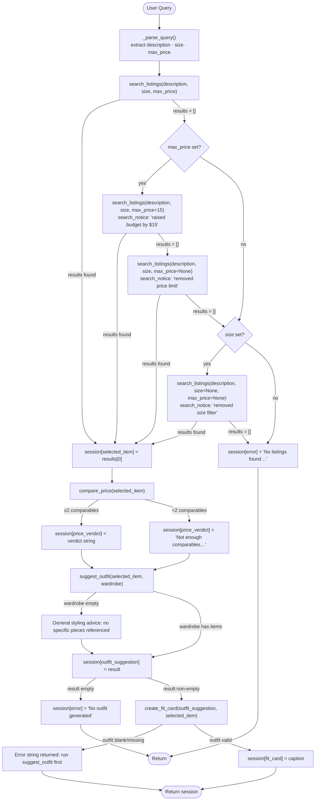

# FitFindr — planning.md

## Tools

List every tool your agent will use. For each tool, fill in all four fields.
You must have at least 3 tools. The three required tools are listed — add any additional tools below them.

### Tool 1: search_listings

**What it does:**
<!-- Describe what this tool does in 1–2 sentences -->
Searches the mock listings dataset and returns matching items. Must handle the case where no matches are found.
search_listings searches against all available field: id, title, description, category, style_tags, size, condition, price, colors, brand, platform

**Input parameters:**
<!-- List each parameter, its type, and what it represents -->
- `description` (str): a visual description of the clothing item that user want.
- `size` (str): the size that the user requested. None if no specific size.
- `max_price` (float): max price that the user requested. None if no price limit.

**What it returns:**
<!-- Describe the return value — what fields does a result contain? -->
Return the matching listings sorted by relevance.
Return a list of dictionary. Each item in the list is clothing item in the listing with the following fields: id, title, description, category, style_tags (list), size, condition, price (float), colors (list), brand, platform.

Best match is put first

**Sample return:**
```python
[
    {
        "id": "lst_023",
        "title": "Crochet Halter Top — Cream",
        "description": "Handmade-looking crochet halter. Ties at the neck and back. Perfect for layering over a tank in summer.",
        "category": "tops",
        "style_tags": ["cottagecore", "boho", "crochet", "summer"],
        "size": "S/M",
        "condition": "excellent",
        "price": 22.00,
        "colors": ["cream", "off-white"],
        "brand": null,
        "platform": "depop"
    },
    {
        "id": "lst_030",
        "title": "Vintage Knit Vest — Argyle Brown/Cream",
        "description": "Classic argyle knit vest in brown and cream. Fits medium. V-neck. Ideal for the dark academia or preppy vintage aesthetic.",
        "category": "tops",
        "style_tags": ["vintage", "preppy", "knitwear", "dark academia", "earth tones"],
        "size": "M",
        "condition": "good",
        "price": 25.00,
        "colors": ["brown", "cream", "tan"],
        "brand": null,
        "platform": "thredUp"
    },
    {
        "id": "lst_032",
        "title": "Shacket — Olive Canvas",
        "description": "Olive canvas shacket — thicker than a shirt, lighter than a jacket. Chest pockets, button-front. Great transitional layer.",
        "category": "outerwear",
        "style_tags": ["earth tones", "classic", "layering", "minimal"],
        "size": "M/L",
        "condition": "excellent",
        "price": 33.00,
        "colors": ["olive", "green"],
        "brand": null,
        "platform": "poshmark"
    }
]
```


**What happens if it fails or returns nothing:**
<!-- What should the agent do if no listings match? -->
It returns an empty list. The agent runs up to three automatic retries with progressively looser constraints before giving up:

1. **Retry 1 — raise price by $15:** If `max_price` was set, retry with `max_price + 15`. If results are found, continue normally and set `session["search_notice"]` to tell the user the budget ceiling was raised by $15.
2. **Retry 2 — drop price limit:** If results are still empty and `max_price` was set, retry with no price filter (`max_price = None`). If results are found, continue normally and note in `session["search_notice"]` that the price limit was removed.
3. **Retry 3 — drop size filter:** If results are still empty and `size` was set, retry with no size filter. If results are found, continue normally and note in `session["search_notice"]` that the size filter was also removed.
4. If results are still empty after all retries, set `session["error"]` and exit early.

---

### Tool 2: suggest_outfit

**What it does:**
<!-- Describe what this tool does in 1–2 sentences -->
Given a specific item and the user's current wardrobe, suggests one or more complete outfit combinations. Must handle an empty or minimal wardrobe.

**Input parameters:**
<!-- List each parameter, its type, and what it represents -->
- `new_item` (dict): the item listing returned by search_listing.
- `wardrobe` (dict): the current user wardrobe following the wardrobe_schema.json.

**What it returns:**
Returns a non-empty string with 1–2 complete outfit suggestions written in natural language.

If the wardrobe is not empty, the suggestions reference specific pieces the user already owns by name (e.g., "pair with your wide-leg jeans and platform Docs").

```python
str  # e.g. "Pair this with your wide-leg jeans and platform Docs for a 90s grunge look."
```


**What happens if it fails or returns nothing:**
<!-- What should the agent do if the wardrobe is empty or no outfit can be suggested? -->
If the wardrobe is empty, the response gives general styling advice instead — what types of pieces pair well and what vibe the item suits.

---

### Tool 3: create_fit_card

**What it does:**
<!-- Describe what this tool does in 1–2 sentences -->
Generates a short, shareable description of a complete outfit — the kind of thing someone would caption an Instagram post with. Must produce something different each time for different inputs.

**Input parameters:**
<!-- List each parameter, its type, and what it represents -->
- `outfit` (str): the complete outfit suggestion string returned by `suggest_outfit()`.
- `new_item` (dict): the listing dict for the thrifted item (used to pull in the item name, price, and platform for the caption).

**What it returns:**
Returns a 2–4 sentence string styled as a casual Instagram/TikTok OOTD caption. The caption mentions the item name, price, and platform naturally (once each), captures the outfit vibe in specific terms, and feels authentic rather than like a product description.

```python
str  # e.g. "thrifted this faded band tee off depop for $22 and it was made for my wide-legs 🖤 full look in my stories"
```

**What happens if it fails or returns nothing:**
<!-- What should the agent do if the outfit data is incomplete? -->
If `outfit` is empty or whitespace-only, the tool returns a descriptive error string (does not raise an exception). The agent surfaces that message to the user and prompts them to first run `suggest_outfit` to generate an outfit before requesting a fit card.

---

### Tool 4: compare_price

**What it does:**
Given a listing item, finds comparable listings in the dataset (same category, at least one shared style tag) and returns a plain-English verdict on whether the price is fair, above average, or a great deal — using rule-based thresholds against the average price of comparables. No LLM call; purely arithmetic.

**Input parameters:**
- `item` (dict): a listing dict (the item the user is considering buying), as returned by `search_listings`.

**What it returns:**
Returns a non-empty string with a verdict label, the item's price, the average and median price of comparable listings, the percentage difference from average, and the count of comparables used.

```python
str  # e.g. "Great deal: $22.00 vs. avg $34.50 / median $33.00 across 8 similar tops listings (-36% vs. average)."
```

Verdict thresholds (based on % difference from average):
- `<= -20%` → "Great deal"
- `<= +5%`  → "Fair price"
- `> +5%`   → "Slightly above average"

**What happens if it fails or returns nothing:**
If fewer than 2 comparable listings are found (same category + at least one shared style tag), the tool returns the string `"Not enough comparable listings to assess pricing."` — does not raise an exception. The agent surfaces this string as-is to the user.

---

## Planning Loop

**How does your agent decide which tool to call next?**
<!-- Describe the logic your planning loop uses. What does it look at? What conditions change its behavior? How does it know when it's done? -->
The planning loop runs tools in a fixed sequence: parse → search (with up to three retries on empty) → price comparison → outfit → fit card. After the initial `search_listings` call, if results are empty the loop tries progressively looser constraints: (1) raise `max_price` by $15, (2) drop the price limit entirely, (3) drop the size filter. Each retry that succeeds records what was relaxed in `session["search_notice"]` so the UI can inform the user. Only after all applicable retries are exhausted does the loop set `session["error"]` and return early. Once a `selected_item` is chosen, `compare_price` is called immediately — its result is stored in `session["price_verdict"]` and is always surfaced regardless of what follows (it never blocks the loop). After `suggest_outfit`, the loop checks whether `session["outfit_suggestion"]` is a non-empty string before calling `create_fit_card`. Apart from the search retries, the loop never backtracks. It knows it is done when either an error gate fires (early return) or `create_fit_card` completes and `session["fit_card"]` is set.

---

## State Management

**How does information from one tool get passed to the next?**
<!-- Describe how your agent stores and accesses state within a session. What data is tracked? How is it passed between tool calls? -->
All state lives in a single session dict initialized by `_new_session()` at the start of each `run_agent()` call. Each tool writes its output to a dedicated field (`search_results`, `selected_item`, `price_verdict`, `outfit_suggestion`, `fit_card`). The next tool reads from the previous field — no state is passed as function arguments across steps, it all flows through the dict. The search step also tracks the effective constraints used (`effective_size`, `effective_max_price`) so retries can build on each previous attempt. If constraints were loosened, `session["search_notice"]` is set to describe what changed so the UI can surface it to the user. `price_verdict` is set immediately after `selected_item` and is never None after that point — `compare_price` always returns a string (either a verdict or the "not enough comparables" fallback). If a step fails permanently, `session["error"]` is set and the loop returns early; downstream fields stay None. The dict is returned at the end so any field can be inspected by the caller.

---

## Error Handling

For each tool, describe the specific failure mode you're handling and what the agent does in response.

| Tool | Failure mode | Agent response |
|------|-------------|----------------|
| search_listings | No results with original filters | Retry up to 3 times: (1) raise `max_price` by $15, (2) drop price limit, (3) drop size filter. Record each relaxed constraint in `session["search_notice"]`. If still empty after all retries, set `session["error"]` and exit early. |
| compare_price | Fewer than 2 comparable listings found | Return the string `"Not enough comparable listings to assess pricing."` and store it in `session["price_verdict"]`. Does not block the loop — outfit and fit card steps proceed normally. |
| suggest_outfit | Wardrobe is empty | Give general styling advice |
| create_fit_card | Outfit input is missing or incomplete | The agent surfaces that message to the user and prompts them to first run `suggest_outfit` to generate an outfit before requesting a fit card. |

---

## Architecture

<!-- Draw a diagram of your agent showing how the components connect:
     User input → Planning Loop → Tools (search_listings, suggest_outfit, create_fit_card)
                                                                          ↕
                                                                   State / Session
     Show what triggers each tool, how state flows between them, and where error paths branch off.
     ASCII art, a Mermaid diagram (https://mermaid.js.org/syntax/flowchart.html), or an embedded
     sketch are all fine. You'll share this diagram with an AI tool when asking it to implement
     the planning loop and each individual tool. -->

---

## AI Tool Plan

<!-- For each part of the implementation below, describe:
     - Which AI tool you plan to use (Claude, Copilot, ChatGPT, etc.)
     - What you'll give it as input (which sections of this planning.md, your agent diagram)
     - What you expect it to produce
     - How you'll verify the output matches your spec before moving on

     "I'll use AI to help me code" is not a plan.
     "I'll give Claude my Tool 1 spec (inputs, return value, failure mode) and ask it to implement
     search_listings() using load_listings() from the data loader — then test it against 3 queries
     before trusting it" is a plan. -->

**Milestone 3 — Individual tool implementations:**
I will give Claude my Tool 1 spec, search_listing() and ask it to implement it using load listings() from data_loader.py. I will then ask it to test against three different queries before accepting it as plan. The test queries will be a part of a pytest module.
For Tool 2, I will give Claude my Tool 2 spec and ask it to implement it. I will also ask it to write three different test against an example wardrobe and a matching fit, an example wardrobe without a matching fit, and an empty wardrobe.
For Tool 3, I will give Claude my Tool 3 spec and ask it to implement create_fit_card(). Claude will also write three tests, one testing with a complete suggestion, one with an incomplete suggestion, and one with the input missing/empty.

**Milestone 4 — Planning loop and state management:**
I will give my Claude my Planning Loop and State Management spec, I will also give the AI the architecture diagram and ask it to implement it. I will also use the plan to verify that what the AI give me conform to the described spec.

---

## A Complete Interaction (Step by Step)

Write out what a full user interaction looks like from start to finish — tool call by tool call. Use a specific example query.

**Example user query:** "I'm looking for a vintage graphic tee under $30. I mostly wear baggy jeans and chunky sneakers. What's out there and how would I style it?"

**Step 1:**
<!-- What does the agent do first? Which tool is called? With what input? -->
Search listing for vintage graphic tee under $30.
Returns 3 matching listings sorted by relevance. FitFindr picks the top result: "Faded Band Tee — $22, Depop, Good condition."

**Step 2:**
<!-- What happens next? What was returned from step 1? What tool is called now? -->
If search listing returned results, then it take that result and the items in the user wardrobe and pass it to suggest_outfit().
returns: "Pair this with your wide-leg jeans and platform Docs for a classic 90s grunge look. Roll the sleeves once and tuck the front corner slightly for shape."

**Step 3:**
<!-- Continue until the full interaction is complete -->
The suggestion and the new thrifted item are then passed into create_fit_card() to generate a social media caption.
returns: "thrifted this faded band tee off depop for $22 and honestly it was made for my wide-legs 🖤 full look in my stories"

**Final output to user:**
<!-- What does the user actually see at the end? -->

User: "I'm looking for a vintage graphic tee under $30. I mostly wear baggy jeans and chunky sneakers. What's out there and how would I style it?"

System:
Searching listing for vintage graphic tee under $30.

I found 3 matching listings [sorted by relevance]. 
The top result is: "Faded Band Tee — $22, Depop, Good condition."

Looking through your wardrobem you can pair this with your wide-leg jeans and platform Docs for a classic 90s grunge look. Roll the sleeves once and tuck the front corner slightly for shape.

A social media caption might look like: "thrifted this faded band tee off depop for $22 and honestly it was made for my wide-legs 🖤 full look in my stories"


