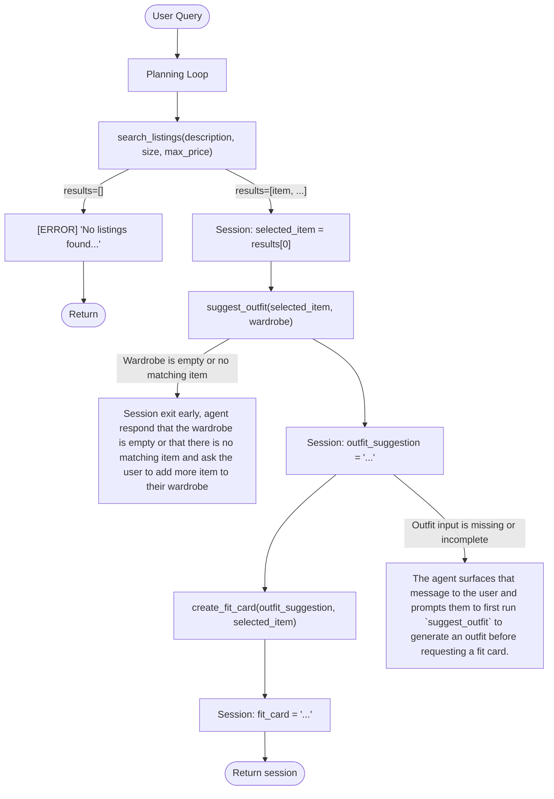

# FitFindr — planning.md

> Complete this document before writing any implementation code.
> Your spec and agent diagram are what you'll use to direct AI tools (Claude, Copilot, etc.) to generate your implementation — the more specific they are, the more useful the generated code will be.
> Your planning.md will be reviewed as part of your submission.
> Update it before starting any stretch features.

---

## Tools

List every tool your agent will use. For each tool, fill in all four fields.
You must have at least 3 tools. The three required tools are listed — add any additional tools below them.

### Tool 1: search_listings

**What it does:**
<!-- Describe what this tool does in 1–2 sentences -->
Searches the mock listings dataset and returns matching items. Must handle the case where no matches are found.
search_listings searches against all available field: id, title, description, category, style_tags, size, condition, price, colors, brand, platform

**Input parameters:**
<!-- List each parameter, its type, and what it represents -->
- `description` (str): a visual description of the clothing item that user want
- `size` (str): the size that the user requested. If no size is asked then prompt the user
- `max_price` (float): max price that the user requested. If no price is requested then ask the user. Can be fill in with an None to indicate no price limit.

**What it returns:**
<!-- Describe the return value — what fields does a result contain? -->
Return the matching listings sorted by relevance.
Return a list of dictionary. Each item in the list is clothing item in the listing with the following fields: id, title, description, category, style_tags (list), size, condition, price (float), colors (list), brand, platform.

Best match is put first

**Sample return:**
```python
[
    {
        "id": "lst_023",
        "title": "Crochet Halter Top — Cream",
        "description": "Handmade-looking crochet halter. Ties at the neck and back. Perfect for layering over a tank in summer.",
        "category": "tops",
        "style_tags": ["cottagecore", "boho", "crochet", "summer"],
        "size": "S/M",
        "condition": "excellent",
        "price": 22.00,
        "colors": ["cream", "off-white"],
        "brand": null,
        "platform": "depop"
    },
    {
        "id": "lst_030",
        "title": "Vintage Knit Vest — Argyle Brown/Cream",
        "description": "Classic argyle knit vest in brown and cream. Fits medium. V-neck. Ideal for the dark academia or preppy vintage aesthetic.",
        "category": "tops",
        "style_tags": ["vintage", "preppy", "knitwear", "dark academia", "earth tones"],
        "size": "M",
        "condition": "good",
        "price": 25.00,
        "colors": ["brown", "cream", "tan"],
        "brand": null,
        "platform": "thredUp"
    },
    {
        "id": "lst_032",
        "title": "Shacket — Olive Canvas",
        "description": "Olive canvas shacket — thicker than a shirt, lighter than a jacket. Chest pockets, button-front. Great transitional layer.",
        "category": "outerwear",
        "style_tags": ["earth tones", "classic", "layering", "minimal"],
        "size": "M/L",
        "condition": "excellent",
        "price": 33.00,
        "colors": ["olive", "green"],
        "brand": null,
        "platform": "poshmark"
    }
]
```


**What happens if it fails or returns nothing:**
<!-- What should the agent do if no listings match? -->
It should return an empty list. The agent should then report to the user that no matching item can be found in the listing and recommend that user to look for a different item.

---

### Tool 2: suggest_outfit

**What it does:**
<!-- Describe what this tool does in 1–2 sentences -->
Given a specific item and the user's current wardrobe, suggests one or more complete outfit combinations. Must handle an empty or minimal wardrobe.

**Input parameters:**
<!-- List each parameter, its type, and what it represents -->
- `new_item` (dict): the item listing returned by search_listing 
- `wardrobe` (dict): the current user wardrobe following the wardrobe_schema.json

**What it returns:**
Returns a non-empty string with 1–2 complete outfit suggestions written in natural language.

If the wardrobe is not empty, the suggestions reference specific pieces the user already owns by name (e.g., "pair with your wide-leg jeans and platform Docs").

```python
str  # e.g. "Pair this with your wide-leg jeans and platform Docs for a 90s grunge look."
```


**What happens if it fails or returns nothing:**
<!-- What should the agent do if the wardrobe is empty or no outfit can be suggested? -->
If the wardrobe is empty, the response gives general styling advice instead — what types of pieces pair well and what vibe the item suits.

---

### Tool 3: create_fit_card

**What it does:**
<!-- Describe what this tool does in 1–2 sentences -->
Generates a short, shareable description of a complete outfit — the kind of thing someone would caption an Instagram post with. Must produce something different each time for different inputs.

**Input parameters:**
<!-- List each parameter, its type, and what it represents -->
- `outfit` (str): the complete outfit suggestion string returned by `suggest_outfit()`.
- `new_item` (dict): the listing dict for the thrifted item (used to pull in the item name, price, and platform for the caption).

**What it returns:**
Returns a 2–4 sentence string styled as a casual Instagram/TikTok OOTD caption. The caption mentions the item name, price, and platform naturally (once each), captures the outfit vibe in specific terms, and feels authentic rather than like a product description.

```python
str  # e.g. "thrifted this faded band tee off depop for $22 and it was made for my wide-legs 🖤 full look in my stories"
```

**What happens if it fails or returns nothing:**
<!-- What should the agent do if the outfit data is incomplete? -->
If `outfit` is empty or whitespace-only, the tool returns a descriptive error string (does not raise an exception). The agent surfaces that message to the user and prompts them to first run `suggest_outfit` to generate an outfit before requesting a fit card.

---

### Additional Tools (if any)

<!-- Copy the block above for any tools beyond the required three -->

---

## Planning Loop

**How does your agent decide which tool to call next?**
<!-- Describe the logic your planning loop uses. What does it look at? What conditions change its behavior? How does it know when it's done? -->
The planning loop runs tools in a fixed sequence: parse → search → outfit → fit card. It decides what to do next by checking the previous step's output in the session dict. After search_listings, it checks whether session["search_results"] is empty — if so, it sets an error and returns without calling the remaining tools. After suggest_outfit, it checks whether session["outfit_suggestion"] is a non-empty string before calling create_fit_card. The loop never backtracks or repeats a tool. It knows it is done when either an error gate fires (early return) or create_fit_card completes and session["fit_card"] is set.

---

## State Management

**How does information from one tool get passed to the next?**
<!-- Describe how your agent stores and accesses state within a session. What data is tracked? How is it passed between tool calls? -->
All state lives in a single session dict initialized by _new_session() at the start of each run_agent() call. Each tool writes its output to a dedicated field (search_results, selected_item, outfit_suggestion, fit_card). The next tool reads from the previous field — no state is passed as function arguments across steps, it all flows through the dict. If a step fails, session["error"] is set and the loop returns early; downstream fields stay None. The dict is returned at the end so any field can be inspected by the caller

---

## Error Handling

For each tool, describe the specific failure mode you're handling and what the agent does in response.

| Tool | Failure mode | Agent response |
|------|-------------|----------------|
| search_listings | No results match the query | Session exit early, agent response that no listing matches query |
| suggest_outfit | Wardrobe is empty | Session exit early, agent respond that the wardrobe is empty and ask the user to add more item to their wardrobe |
| create_fit_card | Outfit input is missing or incomplete | The agent surfaces that message to the user and prompts them to first run `suggest_outfit` to generate an outfit before requesting a fit card. |

---

## Architecture

<!-- Draw a diagram of your agent showing how the components connect:
     User input → Planning Loop → Tools (search_listings, suggest_outfit, create_fit_card)
                                                                          ↕
                                                                   State / Session
     Show what triggers each tool, how state flows between them, and where error paths branch off.
     ASCII art, a Mermaid diagram (https://mermaid.js.org/syntax/flowchart.html), or an embedded
     sketch are all fine. You'll share this diagram with an AI tool when asking it to implement
     the planning loop and each individual tool. -->

---

## AI Tool Plan

<!-- For each part of the implementation below, describe:
     - Which AI tool you plan to use (Claude, Copilot, ChatGPT, etc.)
     - What you'll give it as input (which sections of this planning.md, your agent diagram)
     - What you expect it to produce
     - How you'll verify the output matches your spec before moving on

     "I'll use AI to help me code" is not a plan.
     "I'll give Claude my Tool 1 spec (inputs, return value, failure mode) and ask it to implement
     search_listings() using load_listings() from the data loader — then test it against 3 queries
     before trusting it" is a plan. -->

**Milestone 3 — Individual tool implementations:**
I will give Claude my Tool 1 spec, search_listing() and ask it to implement it using load listings() from data_loader.py. I will then ask it to test against three different queries before accepting it as plan. The test queries will be a part of a pytest module.
For Tool 2, I will give Claude my Tool 2 spec and ask it to implement it utilizing load_wardrobe_schema(). I will also ask it to write three different test against an example wardrobe and a matching fit, an example wardrobe without a matching fit, and an empty wardrobe.
For Tool 3, I will give Cluade my Tool 3 spec and ask it to implement create_fit_card(). Claude will also write three tests, one testing with a complete suggestion, one with an incomplete suggestion, and one with the input missing/empty.

**Milestone 4 — Planning loop and state management:**
I will give my Claude my Planning Loop and State Management spec, I will also give the AI the architecture diagram and ask it to implement it. I will also use the plan to verify that what the AI give me conform to the described spec.

---

## A Complete Interaction (Step by Step)

Write out what a full user interaction looks like from start to finish — tool call by tool call. Use a specific example query.

**Example user query:** "I'm looking for a vintage graphic tee under $30. I mostly wear baggy jeans and chunky sneakers. What's out there and how would I style it?"

**Step 1:**
<!-- What does the agent do first? Which tool is called? With what input? -->
Search listing for vintage graphic tee under $30.
Returns 3 matching listings sorted by relevance. FitFindr picks the top result: "Faded Band Tee — $22, Depop, Good condition."

**Step 2:**
<!-- What happens next? What was returned from step 1? What tool is called now? -->
If search listing returned results, then it take that result and the items in the user wardrobe and pass it to suggest_outfit().
returns: "Pair this with your wide-leg jeans and platform Docs for a classic 90s grunge look. Roll the sleeves once and tuck the front corner slightly for shape."

**Step 3:**
<!-- Continue until the full interaction is complete -->
The suggestion and the new thrifted item are then passed into create_fit_card() to generate a social media caption.
returns: "thrifted this faded band tee off depop for $22 and honestly it was made for my wide-legs 🖤 full look in my stories"

**Final output to user:**
<!-- What does the user actually see at the end? -->

User: "I'm looking for a vintage graphic tee under $30. I mostly wear baggy jeans and chunky sneakers. What's out there and how would I style it?"

System:
Searching listing for vintage graphic tee under $30.

I found 3 matching listings [sorted by relevance]. 
The top result is: "Faded Band Tee — $22, Depop, Good condition."

Looking through your wardrobem you can pair this with your wide-leg jeans and platform Docs for a classic 90s grunge look. Roll the sleeves once and tuck the front corner slightly for shape.

A social media caption might look like: "thrifted this faded band tee off depop for $22 and honestly it was made for my wide-legs 🖤 full look in my stories"


